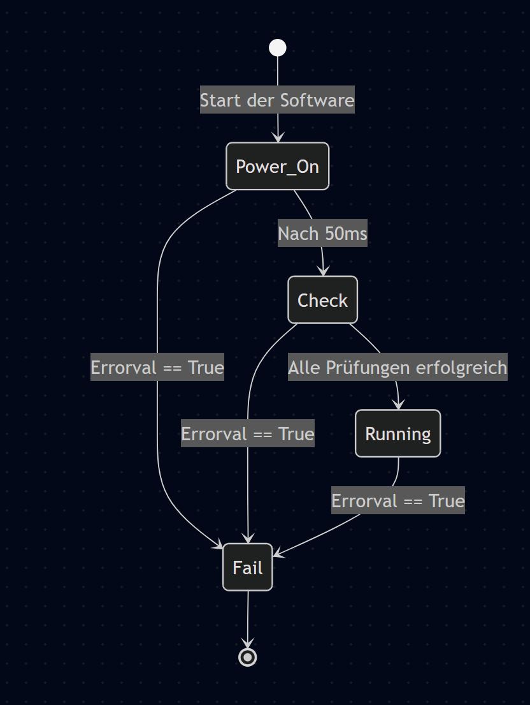

# KI-Anfrage:
 Zeichne ein Ablaufdiagramm für folgende Anforderungen:

- Beim Start der Software soll der Zustand "Power-On" eingenommen werden.

- Wenn der Zustand "Power-On" eingenommen wurde, soll nach 50ms der Zustand "Check" eingenommen werden.

- Wenn der Zustand "Check" eingenommen wurde und alle Prüfungen erfolgreich durchlaufen wurden, soll der Zustand "Running" eingenommen werden.

- Wenn in irgendeinem Zustand die Fehlervariable "Errorval" den Wert True aufweist, soll in den Zustand "Fail" gewechselt werden. 


# Antwort: 
Hier ist das Ablaufdiagramm für deine Anforderungen. Da ich als KI am besten mit Text arbeite, habe ich das Diagramm in der Mermaid-Syntax erstellt. Dies ist ein Standard für textbasierte Diagramme, den du in vielen Markdown-Editoren, Wikis (wie GitHub oder GitLab) oder in Online-Editoren (wie Mermaid Live Editor) direkt anzeigen lassen kannst.

Zusätzlich habe ich den Ablauf als strukturierte Text-Darstellung angefügt.
Mermaid-Diagramm (Zustandsautomat)

Kopiere diesen Code-Block in einen Mermaid-Viewer, um die grafische Darstellung zu sehen:
Code-Snippet
```
stateDiagram-v2
    %% Definition der Zustände
    [*] --> Power_On : Start der Software
    
    %% Normale Übergänge
    Power_On --> Check : Nach 50ms
    Check --> Running : Alle Prüfungen erfolgreich
    
    %% Globale Fehlerbehandlung
    note right of Power_On : Wenn Errorval == True\nWechsel zu Fail
    Power_On --> Fail : Errorval == True
    Check --> Fail : Errorval == True
    Running --> Fail : Errorval == True
    
    %% Endzustand nach Fail (optional, falls es keinen Weg zurück gibt)
    Fail --> [*]
```

Strukturierte Text-Darstellung (ASCII-Stil)

Falls du gerade keinen Viewer zur Hand hast, lässt sich die Logik auch sehr gut so visualisieren:
```

       [ START ]
           |
           v
  +-----------------+
  |    Power-On     |  ---- (Errorval == True) ----+
  +-----------------+                              |
           |                                       |
     (nach 50ms)                                   |
           |                                       |
           v                                       v
  +-----------------+                    +-----------------+
  |      Check      |  ---- (Errorval == True) ---> |       Fail      |
  +-----------------+                    +-----------------+
           |                                       ^
(Prüfungen erfolgreich)                            |
           |                                       |
           v                                       |
  +-----------------+                              |
  |     Running     |  ---- (Errorval == True) ----+
  +-----------------+
```

Zusammenfassung der Logik:

    Initialisierung: Das System beginnt immer im Zustand Power-On.

    Zeitgesteuerter Wechsel: Ein reiner Timer-Übergang (50ms) führt zu Check.

    Bedingter Wechsel: Nur wenn die internen Prüfungen ein "OK" zurückgeben, geht es weiter in Running.

    Globaler Interrupt/Fehler: Der Überprüfungsmechanismus für Errorval = True ist übergeordnet und kann das System aus jedem aktiven Zustand (Power-On, Check, Running) sofort in den Zustand Fail zwingen.





Beispielimplementierung:
https://gemini.google.com/share/d99741c94232